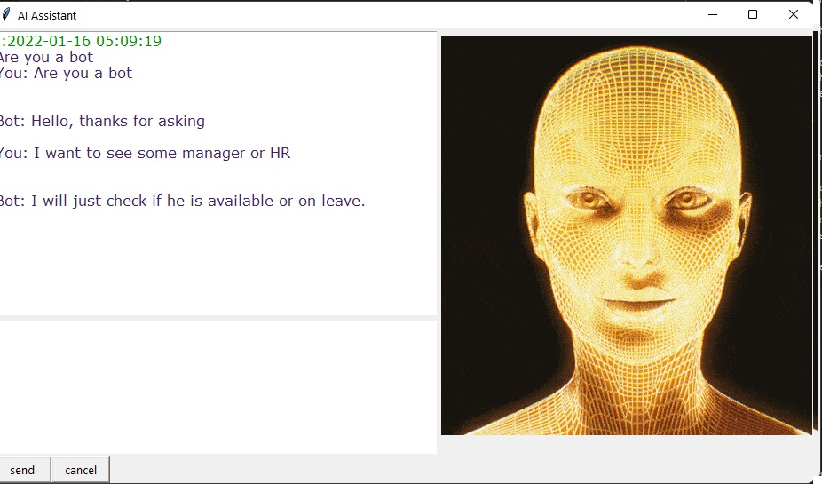

## How to run

1.Install requirements
```
pip install requirements.txt
```

2.GUI

```
python  .\start_assistant.py
```

## Retraining

Update dataset in "intent.json" and then
```
python  .\retrain_assistant.py
```


Sample Screenshots





Analysis
